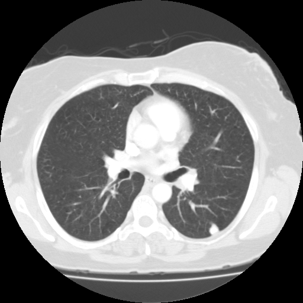

# PureVision

PureVision is a MedGemma 1.5-based baseline for medical image understanding. It trains separate phenotype and anatomy vision encoders, aligns their features with text, and generates reports with a frozen decoder.

## Overview

This repository provides a complete LIDC-IDRI pulmonary nodule training example. It also includes data construction recipes and dataset-driven evaluation tools for CBIS-DDSM and 3DReasonKnee. Anatomy and phenotype categories are read from each dataset's `dataset_contract.json`.

Full datasets and model checkpoints are not included. A de-identified LIDC-IDRI test image and mask are provided in [`examples/lidc_case_0079/`](examples/lidc_case_0079/) for a real-case check.

<p align="center"></p>

## Quick Start

```bash
git clone https://github.com/wanghao1118/purevision.git
cd purevision
python -m pip install -e '.[preprocess,construction,parser,test]'
python -m pytest -q
```

Place your datasets and MedGemma 1.5 weights outside the repository, then update the local configuration paths. Dataset builders are in [`dataset_construction/`](dataset_construction/), with recipes in [`dataset_recipes/`](dataset_recipes/). Use [`scripts/build_dataset_contract.py`](scripts/build_dataset_contract.py) to create a contract from a constructed dataset.

## Training

The LIDC-IDRI pipeline uses configs `01` through `05` for local phenotype training, full-image phenotype training, anatomy training, and shared alignment. Run the stages in order:

```bash
torchrun --nproc_per_node=2 -m purevision.train --config configs/01_phenotype_local.yaml
torchrun --nproc_per_node=2 -m purevision.train --config configs/02_phenotype_global.yaml --initialize-from runs/phenotype_local/best.pt
python scripts/train_anatomy_base.py --config configs/03_anatomy_base.yaml
python scripts/train_anatomy.py --config configs/04_anatomy_final.yaml --initialize-from runs/anatomy_base/best.pt
python scripts/extract_alignment_features.py --config configs/05_alignment.yaml --kind all
python scripts/train_alignment.py --config configs/05_alignment.yaml
```

## Test

Check the included LIDC-IDRI case without model weights:

```bash
PYTHONPATH=src python scripts/run_real_case.py --check-only
```

With the weights and data paths specified in [`configs/07_medgemma15_reproduction_smoke.yaml`](configs/07_medgemma15_reproduction_smoke.yaml), run native MedGemma 1.5 and PureVision on the same case:

```bash
PYTHONPATH=src python scripts/run_real_case.py --config configs/07_medgemma15_reproduction_smoke.yaml
```

For dataset-level evaluation, use [`scripts/build_benchmark.py`](scripts/build_benchmark.py) and [`scripts/score_benchmark.py`](scripts/score_benchmark.py) with a dataset contract.

## Report Parsing

[`src/purevision/rrg_parser.py`](src/purevision/rrg_parser.py) provides a GPT6-Astra report parser. Set your own `OPENAI_API_KEY` and run [`scripts/parse_rrg_report.py`](scripts/parse_rrg_report.py) with a dataset contract and generated report. No API key is stored in this repository.
